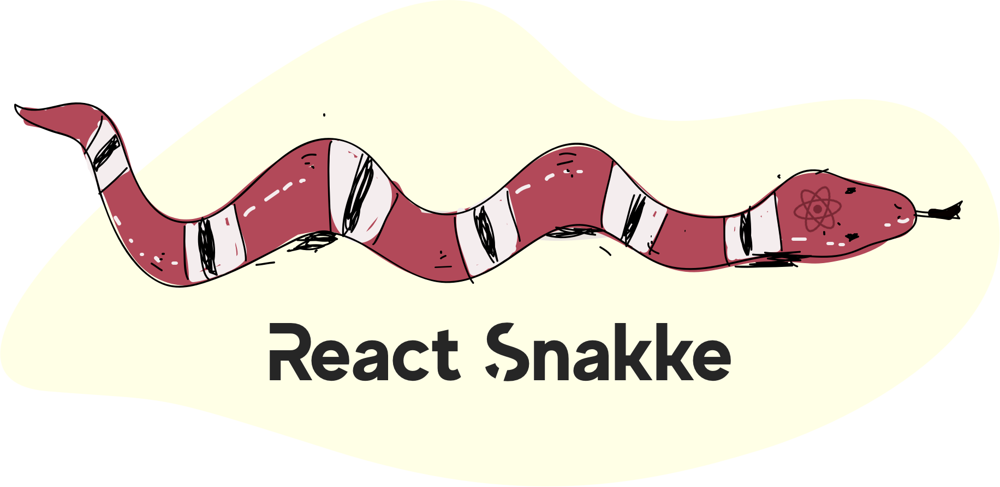

<p align="center">
  
</p>

<p align="center">
  <a href="https://travis-ci.org/diogomoretti/react-snakke/builds"></a> <a href="https://www.npmjs.com/package/react-snakke"></a> <a href="https://standardjs.com"></a>
</p>

## Install

#### npm
```bash
npm install --save react-snakke
```

#### yarn
```bash
yarn add react-snakke
```

## Usage

#### default

```jsx
import React from 'react'

import Snakke from 'react-snakke'

export default function Example () {
  return (
    <Snakke />
  )
}
```

#### with custom values

```jsx
import React from 'react'

import Snakke from 'react-snakke'

export default function Example () {
  return (
    <Snakke
      color='#f0f'
      top='20px'
      height='3px'
      opacity='.8'
      zIndex='10'
      shadow
    />
  )
}
```

## Options / Props

| Prop    | Type   | Default value | Required | Description                       |
|---------|--------|---------------|----------|-----------------------------------|
| color   | String | #000          | false    | Set progress bar background color |
| height  | String | 5px           | false    | Set height of progress bar        |
| opacity | String | 1             | false    | Set opacity from 0 to 1           |
| top | String | 0             | false    | Set distance from top of page           |
| zIndex  | String | 9999          | false    | Set value based on css z-index property    |
| shadow  | Boolean | false          | false    | Progress bar with or without shadow    |

## License

MIT © [Diogo Moretti](https://github.com/diogomoretti)
