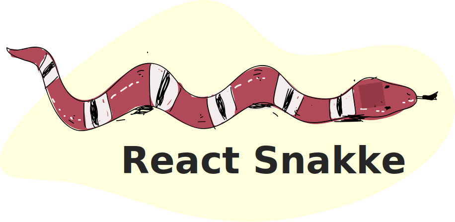

<h1 align="center">
  
</h1>

<p align="center">
  <b>Reading position indicator to React</b>
</p>

<p align="center">
<a href="https://www.npmjs.com/package/react-snakke"></a> <a href="https://standardjs.com"></a>
</p>

## Install

```bash
npm install --save react-snakke
```

## Usage

```jsx
import React, { Component } from 'react'

import MyComponent from 'react-snakke'

class Example extends Component {
  render () {
    return (
      <MyComponent />
    )
  }
}
```

## License

MIT © [diogomoretti](https://github.com/diogomoretti)
